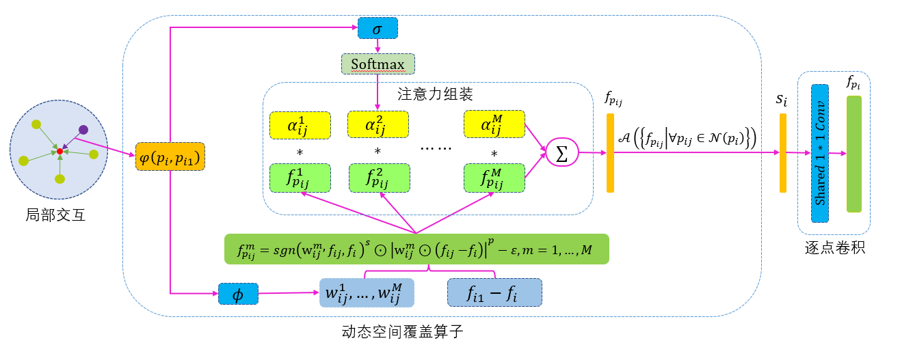

# 3D Point Cloud Classification Method Based on Dynamic Coverage of Local Area
基于局部区域动态覆盖的3D点云分类方法


by [Changshuo Wang*](https://www.changshuowang.site/about/), [Han Wang](), [Xin Ning](), [Weisheng Tian](), and [Weijun Li]().

## Introduction
This code is the pytorch 0.4 version of DC-CNN to reproduce **3D Point Cloud Classification Method Based on Dynamic Coverage of Local Area** on the ModelNet40.<br>

Requirement
----------------------
Ubuntu 18.04<br>
Python 3.7.10 (recommend Anaconda3)<br>
Pytorch 0.4.1<br>
CMake 3.10.2<br>
CUDA 10.0 + cuDNN 7<br>
Cudatoolkit V10.0.130<br>

conda install pytorch=0.4.1 cuda92 -c pytorch

Note: If you want to run DC-CNN code in pytorch1.7+ environment, you can run [DC-CNN_ScanObjectNN](https://github.com/changshuowang/DC-CNN_ScanObjectNN) on ScanObjectNN dataset.

Download
--------
git clone https://github.com/changshuowang/DC-CNN.git<br>
cd changshuowang/DC-CNN<br>

Building Kernel
---------------
mkdir build && cd build<br>
cmake .. && make<br>

Dataset
-------
Download and unzip [ModelNet40](https://shapenet.cs.stanford.edu/media/modelnet40_ply_hdf5_2048.zip) (415M) in data directory. 
<br>


Usage: Train
------------
```
python train_cls.py
```
<br>

Note: We have trained a Single-Scale-Neighborhood classification model in ```log/seed_XXX-XXX/``` folder. <br>

Usage: Evaluation
-----------------
```
python voting_evaluate_cls.py
```
<br>

Note: You can use your model ```log/seed_XXX-XXX/*.pth``` as the checkpoint in ```cfgs/config_ssn_cls.yaml```, and with majority voting you will get an accuracy of 93.6% from the single-scale-neighborhood classification model. The performance on ModelNet40 of almost all methods are not stable, see [(CVMI-Lab/PAConv#9 (comment))](https://github.com/CVMI-Lab/PAConv/issues/9). If you run the same codes for several times, you will get different results.  <br>


## Contact

You are welcome to send pull requests or share some ideas with us. 

contact email: [wangchangshuo@semi.ac.cn](wangchangshuo@semi.ac.cn).

## Acknowledgement

Our code base is partially borrowed from [EllipsoidQuery](https://github.com/VimsLab/EllipsoidQuery), [RS-CNN](https://github.com/Yochengliu/Relation-Shape-CNN/) and [Pointnet2_PyTorch](https://github.com/erikwijmans/Pointnet2_PyTorch).

## LICENSE
DC-CNN is under the Apache-2.0 license. 
Please contact the authors for commercial use.
